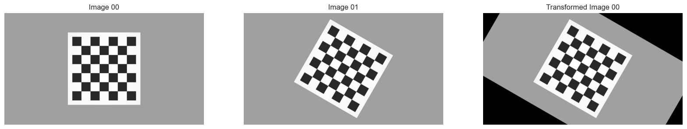
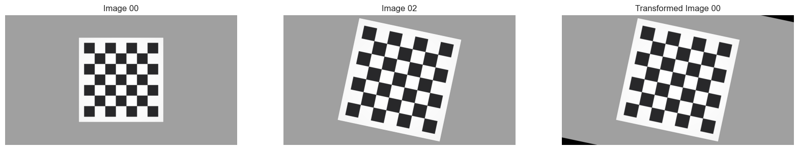
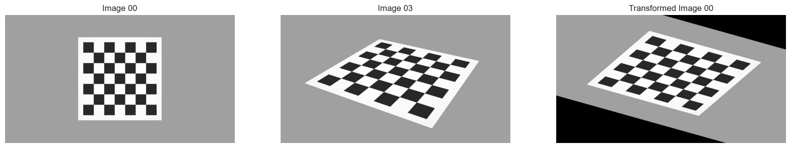
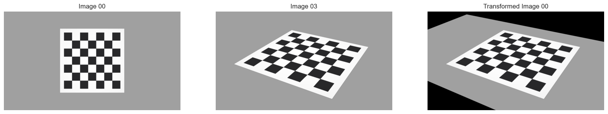

# Homography Estimator

This repository provides an implementation of the `HomographyEstimator` class, a robust framework for computing homography matrices based on various transformation models. The class also includes a RANSAC algorithm for robust estimation of homographies in the presence of outliers.

## Features

- **Transformation Models**:

  - **Euclidean**: Rigid transformations including rotation and translation.
  - **Similarity**: Scaling, rotation, and translation.
  - **Affine**: Linear transformations including shearing.
  - **Projective**: Full perspective transformations.

- **RANSAC Integration**:

  - Robust estimation of homography matrices.
  - Automatic handling of outliers using a distance threshold.

## Methods

### `compute_homography(features, matches, model)`

Computes the homography matrix based on the selected transformation model.

#### Parameters:

- `features`: List of points from the source image.
- `matches`: List of corresponding points in the destination image.
- `model`: Transformation model (`'Euclidean'`, `'Similarity'`, `'Affine'`, `'Projective'`).

#### Returns:

- `H`: Computed homography matrix.

### `ransac(features, matches, model, iterations=9, threshold=3.0)`

Performs robust homography estimation using the RANSAC algorithm.

#### Parameters:

- `features`: Numpy array of source image points.
- `matches`: Numpy array of destination image points.
- `model`: Transformation model (`'Euclidean'`, `'Similarity'`, `'Affine'`, `'Projective'`).
- `iterations`: Number of RANSAC iterations (default: 9).
- `threshold`: Distance threshold for inlier classification (default: 3.0).

#### Returns:

- `best_H`: Best homography matrix found.
- `inliers`: List of indices corresponding to inlier matches.

## RANSAC Iteration Table

The following table shows the required number of iterations for RANSAC based on the proportion of outliers (`e`) and the size of the sample (`s`):

| s | 5% | 10% | 20% | 25% | 30% | 40% | 50% |
|---|-----|-----|-----|-----|-----|-----|-----|
| 2 |   2 |   3 |   5 |   6 |   7 |  11 |  17 |
| 3 |   3 |   4 |   7 |   9 |  11 |  19 |  35 |
| 4 |   3 |   5 |   9 |  13 |  17 |  34 |  72 |
| 5 |   4 |   6 |  12 |  17 |  26 |  57 | 146 |
| 6 |   4 |   7 |  16 |  24 |  37 |  97 | 293 |
| 7 |   4 |   8 |  20 |  33 |  54 | 163 | 588 |

## Example Usage

```python
import numpy as np

# Example feature points
features = np.array([(0, 0), (1, 0), (1, 1), (0, 1)], dtype=np.float32)
matches = np.array([(0, 0), (2, 0), (2, 2), (0, 2)], dtype=np.float32)

# Initialize estimator
estimator = HomographyEstimator()

# Compute homography using RANSAC
H, inliers = estimator.ransac(features, matches, model='Projective')
print("Homography Matrix:", H)
print("Inliers:", inliers)
```

## Requirements

- Python 3.x
- NumPy

## How It Works

1. **Model Selection**: The `HomographyEstimator` selects the appropriate transformation model (`Euclidean`, `Similarity`, `Affine`, or `Projective`) to compute the homography matrix.
2. **Matrix Computation**: The transformation is computed using least squares for the selected model.
3. **RANSAC**: To handle outliers, the RANSAC algorithm iteratively selects subsets of points, computes a homography, and evaluates the number of inliers based on a distance threshold.

## Results
- Euclidean Transformation:
  
- Similarity Transformation:
  
- Affine Transformation:
  
- Projective Transformation:
  